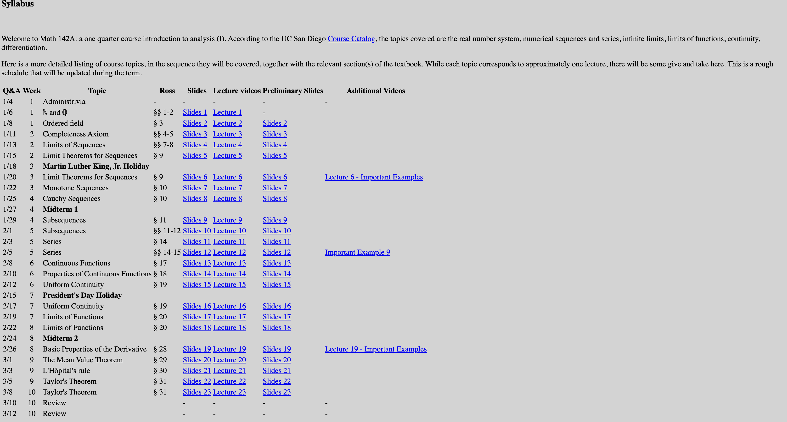

# Calculus and Analytics

Generally, as for computer science researcher, especially AI researcher, seems that learning calculus or mathematical analytics is useless.

However, I believe that if I were a Ph.D. student, it is shameless if I do not know the mathematical knowledge. I collect several excellent calculus course here.

## Calculus

In calculus, we mainly focus is on how to calculate integrals, how to find derivatives, and how to analyze infinitesimals.

### MATH4007 Calculus I-IV

**Instructor:** 蔡雅如

**Semester:** 2023 Fall; 2024 Fall.

**Star:** ⭐️⭐️⭐️⭐️⭐️

**Course Website:** [啊~~Ya-Ju's 微積分教室](https://www.youtube.com/@yjtsaimath/courses)

### MATH4007 Calculus I-IV

**Instructor:** 蔡國榮

**Semester:** 2022 Fall

**Star:** ⭐️⭐️⭐️⭐️⭐️

**Course Website:** [Kuo-Wing Tsai's Homepage](https://sites.google.com/site/tsoighaleo/teaching)

## Analytics

### MATH142a Introduction to Analysis I, UCSD

**Instructor:** Yuriy Nemish

**Semester:** 2021 Winter

**Star:** ⭐️⭐️⭐️⭐️⭐️

**Course Website:** [MATH142a Introduction to Analysis I](https://mathweb.ucsd.edu/~ynemish/old/2021/142a/index.html)

#### Syllabus

