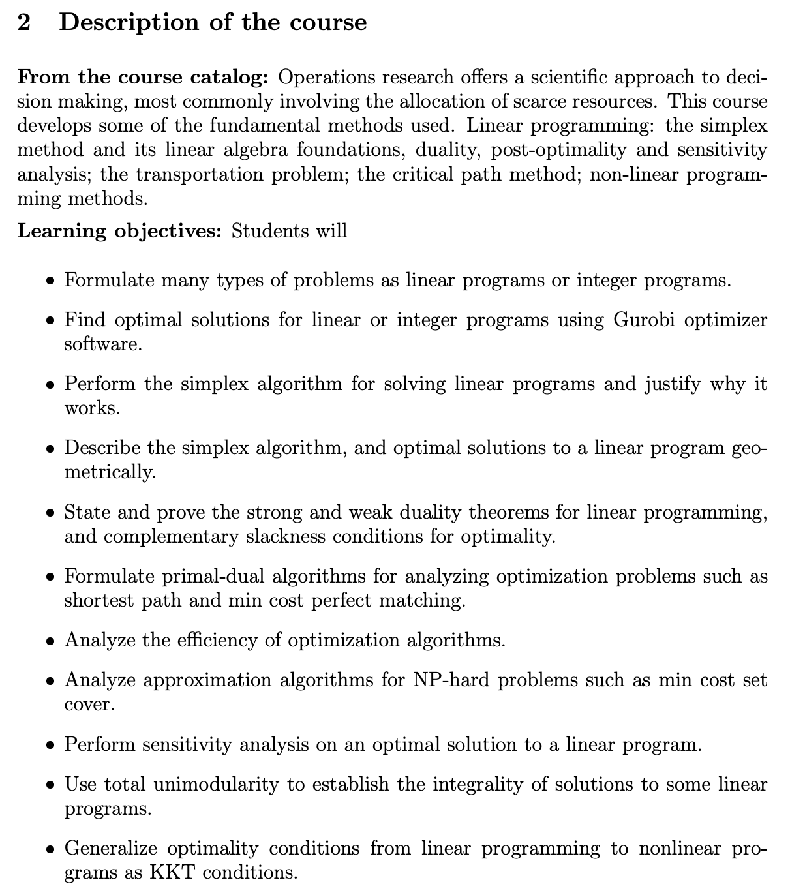

# Optimisation

## 21-292: Operations Research I

**Semester:** 2023 Spring, 2025 Spring

**University Offered:** CMU

**Video Available:** YES

**Course Website:** [2023 Spring](https://canvas.cmu.edu/courses/33035), [2025 Spring](https://canvas.cmu.edu/courses/45012)

### Syllabus

## 10-725: Convex Optimization

**Semester:** 2022 Fall

**University Offered:** CMU

**Video Available:** YES

**Course Website:** [10-725 Convex Optimization Recordings](https://scs.hosted.panopto.com/Panopto/Pages/Sessions/List.aspx#folderID=%2235028909-68d2-46be-b0d8-af020148d304%22)

## STAT9910-303: Large-Scale Optimization for Data Science

**Semester:** 2023 Fall

**University Offered:** University of Pennsylvania

**Video Available:** NO

**Course Website:** [STAT9910-303: Large-Scale Optimization for Data Science](https://yuxinchen2020.github.io/large_scale_optimization/syllabus.html)

